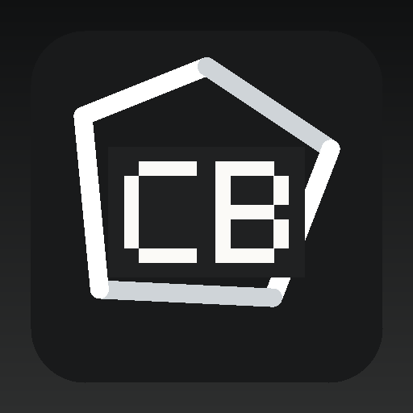

<p align="center"></p>

# Cbschmitt

**Knowledge Built to Travel.**

A modern learning brand focused on courses, educational content, resources, and accessible digital experiences.

> **A learning experience organized around clear paths, useful resources, and content that is easy to navigate.**

---

## Overview

Cbschmitt is represented as a complete digital system: brand identity, product architecture, support, documentation, developer experience, trust, resources, policies, and a production-oriented GitHub Pages website.

## Core Capabilities

- **Courses** — Courses is treated as part of the complete Cbschmitt experience — designed to clarify the system while keeping the experience clear, useful, and maintainable.
- **Learning Paths** — Learning Paths is treated as part of the complete Cbschmitt experience — designed to shape the system while keeping the experience clear, useful, and maintainable.
- **Resources** — Resources is treated as part of the complete Cbschmitt experience — designed to connect the system while keeping the experience clear, useful, and maintainable.
- **For Teams** — For Teams is treated as part of the complete Cbschmitt experience — designed to connect the system while keeping the experience clear, useful, and maintainable.
- **Support** — Support is treated as part of the complete Cbschmitt experience — designed to shape the system while keeping the experience clear, useful, and maintainable.

## Operating Principles

- **Learning** — part of the core brand direction.
- **Access** — part of the core brand direction.
- **Clarity** — part of the core brand direction.
- **Growth** — part of the core brand direction.

## Website Standard

The website is generated for GitHub Pages with responsive layouts, local branded imagery, accessible navigation, SEO metadata, structured data, search, a sitemap, robots.txt, a web manifest, product pages, developer pages, support infrastructure, trust content, policies, and automated validation.

Website: https://cbschmitt.github.io/

## Support

- Support Center: https://cbschmitt.github.io/support.html
- Support phone: +1 202-555-0130
- Sales phone: +1 202-555-0129
- Public business email: support@cbschmitt.example
- Availability: DEMO · Mon–Fri · 09:00–17:00
- GitHub: https://github.com/cbschmitt

> Connected-account email addresses are private by default and are never copied into the public website automatically.

## Repository Ecosystem

```text
cbschmitt
cbschmitt.github.io
```

## Brand Assets

- `brand/profile-avatar.png` — 512×512 PNG generated below GitHub's 1 MB profile-picture limit.
- `brand/logo.svg` — scalable brand mark.
- `brand/visual-hero.svg` — local branded hero artwork.
- `brand/brand.json` — machine-readable brand metadata.

## Privacy & Secret Safety

BrandForge V14 runs a publication gate that looks for account-email leakage and common secret patterns before publishing. Provider keys and GitHub credentials belong in secure server-side secrets, not HTML, client-side JavaScript, README files, or public repositories.

## Publishing Standard

Public claims should remain accurate and verifiable. BrandForge does not invent customers, testimonials, awards, certifications, business locations, product inventory, pricing, service guarantees, carrier coverage, uptime, call volume, or social accounts. V14 can generate reserved fictional phone/email placeholders for mockups, but it never publishes them as real contact channels.

---

© 2026 Cbschmitt. All rights reserved.
